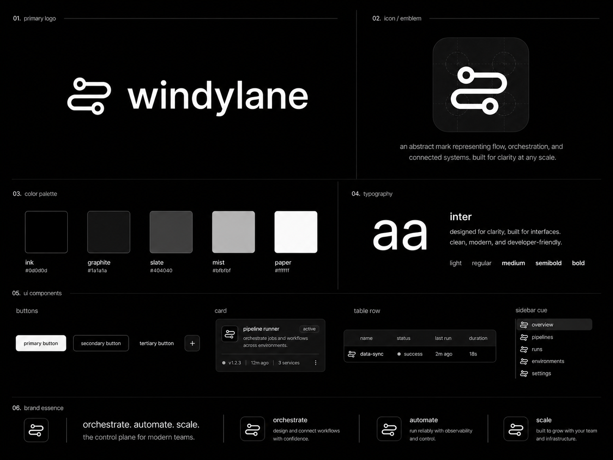

# windylane

stay in flow.



windylane is a self-hosted control plane for distributed task execution and
webhook delivery, built with Go, Postgres, Redis, Next.js, and Tailwind CSS.
The product target is [`windylane.dev`](https://windylane.dev).

Current release: [`v0.4.0-windylane`](https://github.com/shyxur/windylane/releases/tag/v0.4.0-windylane)

QueueFlow provides a multi-tenant, at-least-once task queue. Postgres is the
durable source of truth; Redis handles priority-aware dispatch and hot state.
EventForge adds tenant-scoped, signed webhook delivery for task lifecycle
events.

## Core features

- Mandatory idempotency keys, strict request validation, rate limiting, and
  request body limits.
- Priority-aware Redis dispatch with durable Postgres task state.
- Worker heartbeats, visibility timeouts, graceful shutdown, retries, backoff,
  dead-letter queues, and Redis reconstruction.
- Tenant-scoped task APIs and real-time status updates over Server-Sent Events.
- Server-rendered operations dashboard for tasks, workers, DLQ, webhooks, and
  webhook deliveries.
- Encrypted webhook signing secrets, `X-Windylane-*` signatures, delivery
  retries, and delivery logs.

## Architecture

```text
HTTP /v1 handlers
    -> authentication + validation
    -> task usecases
    -> storage/broker ports
    -> Postgres + Redis adapters

Worker pool
    -> Postgres claim + visibility heartbeat
    -> handler execution
    -> retry/backoff or DLQ
    -> Redis ACK/NACK
```

- `internal/api`: HTTP routing, middleware, request validation and responses.
- `internal/usecase`: producer-side orchestration.
- `internal/domain`: task lifecycle and retry policy.
- `internal/ports`: storage and broker contracts.
- `internal/storage/postgres`: tenant-scoped durable state.
- `internal/broker/redis`: pending, processing, delayed and DLQ transport.
- `internal/engine`, `internal/worker`: execution, retry, reclaim and shutdown.

Redis messages contain `org_id` and `task_id`. Keys use:

```text
queueflow:v1:org:{org_id}:queue:{queue}:pending
queueflow:v1:org:{org_id}:queue:{queue}:processing
queueflow:v1:org:{org_id}:queue:{queue}:delayed
queueflow:v1:org:{org_id}:queue:{queue}:dlq
```

Pending and processing state use Redis sorted sets. Priorities range from `0`
to `9`; higher values are dispatched first. A per-queue monotonic sequence
preserves FIFO ordering within the same priority. Delayed promotion reads the
stored priority before returning a task to the pending set.

## Local setup

Requirements: Go 1.25+, Docker with Docker Compose, Node.js, and npm.

```bash
git clone https://github.com/shyxur/windylane.git
cd windylane

docker compose up --build
```

In a second terminal:

```bash
cd windylane/apps/dashboard
cp .env.example .env.local
npm install
npm run dev
```

Docker Compose starts Postgres, Redis, migrations, the API, QueueFlow workers,
and the EventForge delivery worker. The dashboard intentionally runs outside
Compose for fast frontend iteration. Use `make up` for detached backend startup
and `make dashboard` as shortcuts for the same development workflow.

The first Docker build downloads base images and Go modules, so it can take a
few minutes on a cold cache. Subsequent builds reuse Docker and BuildKit caches
and should complete substantially faster when backend sources are unchanged.

Local endpoints:

- API health: [`http://localhost:8080/healthz`](http://localhost:8080/healthz)
- Dashboard: [`http://localhost:3000`](http://localhost:3000)

Run `make smoke` for the local unit, vet, Compose configuration, dashboard lint,
and dashboard build checks. It does not start services or run integration tests.

Measure startup without deleting local data:

```bash
./scripts/time-startup.sh --down
```

Run without a flag to measure an incremental `up --build -d`. The `--fresh`
flag also deletes the Compose named volume and must be used only when local
Postgres data can be discarded.

Default host ports are `5432`, `6379`, and `8080`. Override them when another
local stack is running:

```bash
POSTGRES_PORT=55433 REDIS_PORT=56380 API_PORT=58080 \
  ./scripts/time-startup.sh --down
```

The migration seeds a development organization:

```text
Org ID:  00000000-0000-4000-8000-000000000001
API key: queueflow-dev-key
```

Only the SHA-256 API-key hash is stored in Postgres. The plaintext key above is
for local development only.

## API

`GET /healthz` and `GET /readyz` are public. All `/v1` routes require:

```http
Authorization: Bearer queueflow-dev-key
```

Routes:

```text
POST   /v1/tasks
GET    /v1/tasks
GET    /v1/tasks/{id}
POST   /v1/tasks/{id}/retry
POST   /v1/tasks/{id}/cancel
DELETE /v1/tasks/{id}
GET    /v1/queues/{name}/stats
GET    /v1/workers
POST   /v1/workers/{id}/heartbeat
GET    /v1/dlq
POST   /v1/dlq/{id}/requeue
GET    /v1/events/tasks
POST   /v1/webhooks/endpoints
GET    /v1/webhooks/endpoints
GET    /v1/webhooks/endpoints/{id}
PATCH  /v1/webhooks/endpoints/{id}
DELETE /v1/webhooks/endpoints/{id}
POST   /v1/webhooks/endpoints/{id}/rotate-secret
GET    /v1/webhooks/deliveries
GET    /v1/webhooks/deliveries/{id}
POST   /v1/webhooks/deliveries/{id}/retry
GET    /healthz
GET    /readyz
```

### Create a task

`Idempotency-Key` is mandatory. Payload JSON is limited to 262,144 bytes and
the complete request body is capped before decoding.

```bash
curl -i http://localhost:8080/v1/tasks \
  -X POST \
  -H 'Authorization: Bearer queueflow-dev-key' \
  -H 'Idempotency-Key: welcome-user-42' \
  -H 'Content-Type: application/json' \
  -d '{
    "queue": "email",
    "payload": {"to": "user@example.com", "template": "welcome"},
    "priority": 5,
    "max_retries": 3,
    "timeout_seconds": 20,
    "visibility_timeout_seconds": 60,
    "scheduled_at": null,
    "backoff_strategy": "exponential"
  }'
```

A new request returns `201`. Repeating the same organization, queue,
`Idempotency-Key`, and canonical request returns the original task with `200`.
Reusing the key with different request fields returns `409`.

### List and inspect

```bash
curl -H 'Authorization: Bearer queueflow-dev-key' \
  'http://localhost:8080/v1/tasks?queue=email&status=pending&limit=50'

curl -H 'Authorization: Bearer queueflow-dev-key' \
  'http://localhost:8080/v1/dlq?queue=email&limit=50'
```

Task list endpoints use opaque cursor pagination and never return data from
another organization.

### Webhook endpoints

Webhook endpoint routes use the same Bearer API-key authentication and
organization scope as QueueFlow. Endpoint signing secrets are encrypted at rest
and returned only in the create or rotate response; list and get responses never
include them. Set a unique `WEBHOOK_SECRET_ENCRYPTION_KEY` outside local
development. Webhook URLs must use HTTPS. For local development only, set
`ALLOW_INSECURE_LOCAL_WEBHOOKS=true` to permit HTTP URLs whose host is localhost
or a loopback IP.

Delivery execution and signing run through the EventForge webhook worker.
See the [EventForge webhook guide](docs/eventforge.md) for endpoint examples,
HMAC verification, delivery logs, retry behavior, worker configuration,
security guidance, and troubleshooting.

## Worker lifecycle

1. The producer inserts the task in Postgres.
2. The task reference is added to the tenant-scoped Redis priority set.
3. A worker atomically moves it to processing and claims the Postgres row.
4. Heartbeats extend the visibility deadline.
5. Success updates Postgres before Redis ACK.
6. Failure updates Postgres and enters the delayed Redis ZSET for backoff.
7. Exhausted tasks become `dead_letter` in Postgres and enter the Redis DLQ.
8. Expired worker claims are reset and re-enqueued.
9. A reconciliation loop dispatches pending rows stranded by a Redis outage.

Workers are configured with `ORG_ID` and `QUEUE_NAME`. Postgres claim rules
prevent active processing rows from being claimed again before visibility
expires.

Set `WORKER_DISCOVERY_ENABLED=true` to discover active organization/queue
scopes from Postgres instead. Discovery refreshes every
`WORKER_DISCOVERY_INTERVAL_SEC` (default `10`) and starts or drains an isolated
pool per scope. With discovery disabled, the existing explicit
`ORG_ID`/`QUEUE_NAME` mode remains unchanged.

## Commands

```text
make up       Start Postgres, Redis, migrations, API and workers
make down     Stop the local stack
make migrate  Run pending migrations
make test     Run all tests
make test-integration  Run isolated Postgres and Redis integration tests
make lint     Run go vet
make smoke    Run local release-readiness checks
make api      Run the producer API locally
make worker   Run one worker locally
make webhook-worker  Run the EventForge delivery worker locally
make dashboard  Run the Next.js dashboard on localhost:3000
make redis-rebuild  Rebuild pending/delayed Redis state from Postgres
```

Integration tests use `docker-compose.integration.yml`, ephemeral container
filesystems, and alternate host ports. They never reuse the development
Postgres volume. Run them with:

```bash
make test-integration
```

The dashboard lives in `apps/dashboard`. Copy `.env.example` to `.env.local`,
install dependencies, and start it with:

```bash
make dashboard
```

`QUEUEFLOW_API_KEY` is consumed only by Next.js server components and server
actions. It must never use a `NEXT_PUBLIC_` prefix.

Required dashboard environment variables:

```text
QUEUEFLOW_API_BASE_URL=http://localhost:8080
QUEUEFLOW_API_KEY=queueflow-dev-key
```

EventForge dashboard routes:

```text
/webhooks
/webhooks/new
/webhooks/{id}
/webhook-deliveries
/webhook-deliveries/{id}
```

For local use, start the API and webhook worker with `make up`, then run
`make dashboard`. Webhook signing secrets appear in the browser only once after
endpoint creation or rotation; the API key remains server-side.

### Redis reconstruction

After a full Redis flush, stop workers and run `make redis-rebuild` with the
normal `DB_DSN` and Redis environment variables. The command scans only
non-deleted `pending` tasks from Postgres, clears any stale hot-state entries,
and rebuilds tenant-scoped pending or delayed entries based on `visible_at`.
It is safe to run repeatedly; Postgres remains authoritative.

### Task event stream

`GET /v1/events/tasks` is an authenticated, tenant-scoped Server-Sent Events
stream. It polls the latest task state every two seconds and emits `task`
events when a task is first observed or its status/update timestamp changes.
The dashboard connects through its own server route so the API key is never
sent to the browser.

## Troubleshooting

- `401`: verify the Bearer key and that it is not revoked.
- `409 idempotency_conflict`: use the original request or a new key.
- `413`: reduce the serialized `payload` below 256 KiB.
- `/readyz` failing: verify both Postgres and Redis are reachable.
- Pending task not visible in Redis: the worker reconciliation loop retries
  undispatched Postgres rows every `RECONCILE_INTERVAL_SEC`.
- Slow first startup: image pulls and Go module downloads are expected once.
  Run `./scripts/time-startup.sh --down` to measure the startup path.
- Slow repeated startup: inspect build output for cache misses and confirm Docker
  Desktop has adequate CPU, memory, and disk available.
- Port already allocated: stop the conflicting local service or set
  `POSTGRES_PORT`, `REDIS_PORT`, and `API_PORT` to unused host ports.

## Visual references

- [Brand board](docs/brand/windylane-brand-board.png)
- [Brand system](docs/brand/brand-system.md)
- [Dashboard visual QA checklist](docs/dashboard-qa.md)
- [Dashboard screenshot policy and placeholders](docs/screenshots/README.md)

Only screenshots captured from a real windylane environment should be added;
generated or mock screenshots are not product evidence.

## Roadmap

- [x] Phase 1 — QueueFlow core task engine and dashboard.
- [x] Phase 2 — EventForge webhook management and delivery lifecycle.
- [ ] Phase 3 — TaskCanvas visual workflow orchestration (not started).
- [ ] Phase 4 — QueueLens observability, metrics, and throughput analytics.

## License and brand policy

Source code is licensed under the [Apache License 2.0](LICENSE).

The windylane name, logo, wordmark, icon, visual identity, brand system, and
files under `docs/brand/` are not open source and are not licensed for reuse as
a brand identity. See the [trademark and brand policy](trademark.md).
